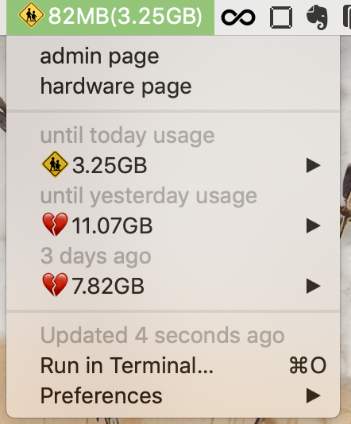

# wifi-transfer-meter

## require

- [bitbar](https://getbitbar.com/)
- ruby : 2.6
- ruby gem : nokogiri
- [Speed Wi-Fi NEXT W06](https://www.uqwimax.jp/wimax/products/w06/)

## screen shot

- [sign] <left value> ( < until today usage > )
- until today usage
    - [sign] < until today usage >
    - :children_crossing: restricted now
    - :broken_heart: over 3.33GB
    - :yellow_heart: over 2.31GB
    - :green_heart: less 2.31GB
    - today + 1 day ago + 2 days ago
- until yesterday usage
    - [sign] < until yesterday usage >
    - :broken_heart: over 10GB
    - :yellow_heart: over  7GB
    - :green_heart: less  7GB
    - 1 day ago + 2 days ago + 3 days ago
- 3 days ago
    - [sign] < 3 days ago >
    - :broken_heart: over 3.33GB
    - :yellow_heart: over 2.31GB
    - :green_heart: less 2.31GB
